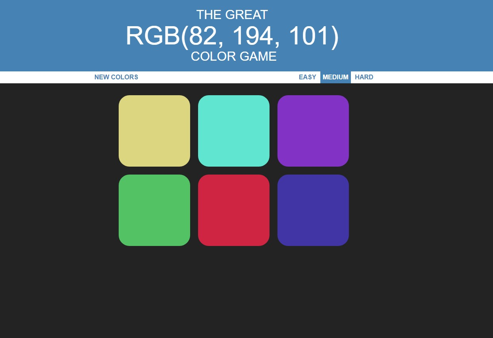

# ml-color-game

This is a simple game where you try to guess the color based of the RGB numbers. This project was built using strictly vanilla javascript. The game is live on https://ml-color-game.herokuapp.com

## Technologies Used

- HTML5
- CSS3
- JavaScript
- Express.Js
- Node.js

# How to play the game

When you goto the website, the game will already be initiated. At the header, there will be three(3) values for RGB and you are to click on the square that you believe the RGB color is. The difficulty is originally set to Medium which will show 6 squares and you can goto Easy (3 squares) or Hard (9 squares). If you guess incorrectly, the incorrect square chosen will disappear and you are to try again until you pick the right color. At the end of the game, you can pick 'Play Again' to play in the difficulty you just played or you can select the other difficulties.
